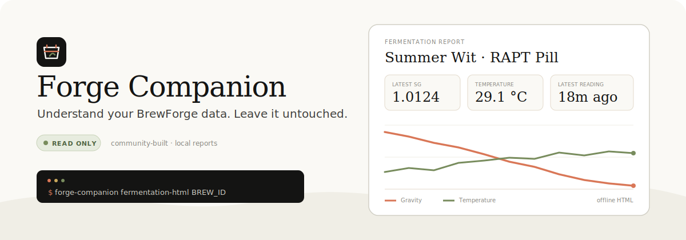
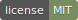
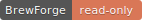
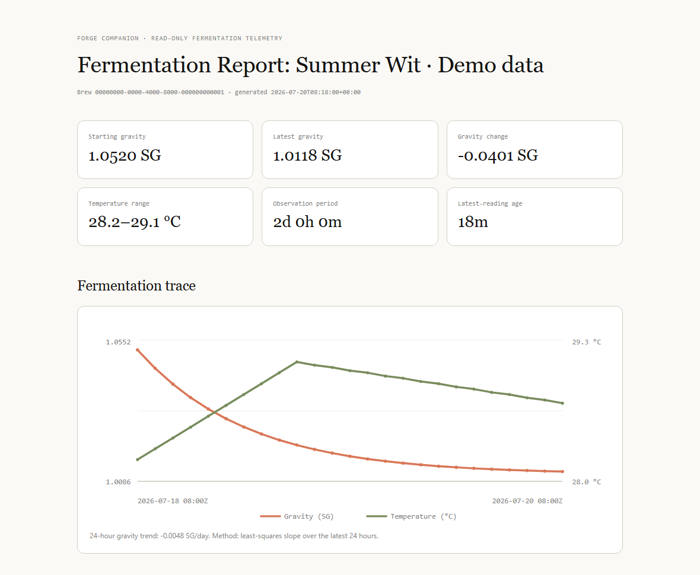

<p align="center">
  
</p>

<p align="center">
  <a href="https://github.com/MrFresskopf/forge-companion/actions/workflows/ci.yml"></a>
  <a href="https://www.python.org/downloads/"></a>
  <a href="LICENSE"></a>
  
</p>

Forge Companion turns [BrewForge](https://brewforge.sh/) data into local snapshots,
inventory checks, CSV exports, and fermentation reports. It never creates, changes, or deletes
anything in BrewForge.

> [!IMPORTANT]
> Forge Companion is an unofficial community project and is not affiliated with or endorsed by
> BrewForge.

> [!NOTE]
> **Developer preview:** Forge Companion is source-installable, read-only, and not yet a complete
> backup solution. Interfaces and snapshot formats may change before 1.0.

## Get running in three steps

You need Python 3.11 or newer, a BrewForge plan with API access, and a token with the narrowest
read scopes needed for your command.

### 1. Install

With [uv](https://docs.astral.sh/uv/getting-started/installation/):

```bash
uv tool install git+https://github.com/MrFresskopf/forge-companion.git
```

Or with [pipx](https://pipx.pypa.io/):

```bash
pipx install git+https://github.com/MrFresskopf/forge-companion.git
```

### 2. Add your token to the current shell

macOS, Linux, or Git Bash:

```bash
export BREWFORGE_API_TOKEN='bfk_your_token_here'
```

Windows Command Prompt (the token is not saved permanently):

```cmd
set /p "BREWFORGE_API_TOKEN=BrewForge API token: "
```

Do not put a real token in a config file, issue, screenshot, or commit.

### 3. Check access and create your first report

```bash
forge-companion doctor
forge-companion fermentation-html --select --temperature-unit C
```

`--select` prints a numbered page of sanitized brew names and prompts for one explicit choice. It
uses the chosen name as the report title, so there is no UUID to copy. The report lands in `reports/`
and opens as a standalone file in any modern browser. For scripts, pass an exact UUID instead.

<p align="center">
  
</p>

## What it does

| Goal | Command | Network use |
|---|---|---:|
| Check token and API access | `forge-companion doctor` | 7 GET requests |
| Find a brew by name | `forge-companion brews` | 1 GET request |
| Save supported collections locally | `forge-companion snapshot` | Paginated GET requests |
| Check inventory from a snapshot | `forge-companion inventory-audit FILE` | Offline |
| Create a Markdown fermentation brief | `forge-companion fermentation-brief BREW_ID` | 2 GET requests |
| Export validated readings | `forge-companion fermentation-csv BREW_ID` | 1 GET request |
| Create an offline visual report | `forge-companion fermentation-html --select` | 2 GET requests |
| Create a scripted offline visual report | `forge-companion fermentation-html BREW_ID` | 1 GET request |
| Simulate a spunding threshold | `forge-companion spunding-advisor BREW_ID ...` | 1 GET request |

See the [command guide](docs/COMMANDS.md) for options, output details, and examples.

## Why read-only?

Brewing data is useful; accidental writes are not. Forge Companion starts with a deliberately small
trust boundary:

- the API client exposes only `GET`
- tokens come only from `BREWFORGE_API_TOKEN`
- default `reports/` and `snapshots/` destinations stay local and are ignored by Git; custom output
  paths remain your responsibility
- collection snapshots abort on invalid or incomplete pages; fermentation exports keep valid
  readings but report every rejection and timestamp conflict
- the spunding advisor simulates a decision and never contacts hardware

The generated HTML report is one offline file with no JavaScript, remote fonts, tracking, or external
assets. It describes telemetry but does not decide that fermentation is complete.

## Install for development

```bash
git clone https://github.com/MrFresskopf/forge-companion.git
cd forge-companion
uv sync --extra dev
uv run forge-companion --help
```

Run the quality checks before opening a pull request:

```bash
uv run pytest
uv run ruff check .
uv run mypy
```

## Project status

Forge Companion is young and intentionally conservative. Collection snapshots, inventory audits,
fermentation exports/reports, and fail-closed spunding simulations work today. MQTT, Home Assistant,
and hardware bridges remain future work.

The snapshot command currently covers supported top-level collections. It is not yet a complete or
restorable account backup. See the [roadmap](docs/ROADMAP.md) for current scope and non-goals.

## Contributing

Small, test-backed changes are welcome. Read [CONTRIBUTING.md](CONTRIBUTING.md) before submitting a
pull request, and never include private brew data or real API tokens in fixtures, screenshots, issues,
or commits.

Security reports belong in the private process described in [SECURITY.md](SECURITY.md).

If Forge Companion is useful and you are considering BrewForge, you can
[support the project with this referral link](https://brewforge.sh/r/ckpejh7o). The destination is
the normal BrewForge service; the link credits this project when you sign up.

## License

MIT. See [LICENSE](LICENSE).
