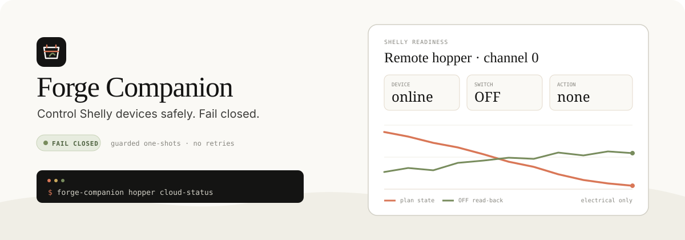
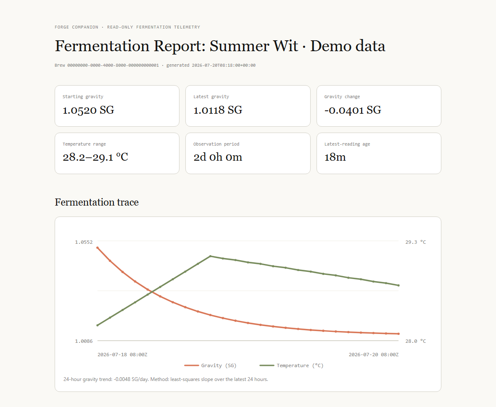

<p align="center">
  
</p>

<p align="center">
  <a href="https://github.com/MrFresskopf/forge-companion/actions/workflows/ci.yml"></a>
  <a href="https://www.python.org/downloads/"></a>
  <a href="LICENSE"></a>
  
</p>

Forge Companion provides fail-closed Shelly control for brewery automation: offline planning,
read-only device checks, explicitly armed one-shot actions, and durable audit history. Optional
[BrewForge](https://brewforge.sh/) access remains read-only and supplies brew context, telemetry,
reports, and snapshots.

> [!IMPORTANT]
> Forge Companion is an unofficial community project and is not affiliated with or endorsed by
> BrewForge.

> [!NOTE]
> **Developer preview:** Live Shelly actuation is experimental and isolated behind explicit one-shot
> safety controls. Electrical `OFF` is not proof of mechanical success. BrewForge access is read-only;
> interfaces and snapshot formats may change before 1.0.

## Start with Shelly safely

You need Python 3.11 or newer. Read-only local Shelly status needs only device reachability. Shelly
Cloud commands use a separate native-keyring profile; optional BrewForge reports require API access.

### 1. Install

With [uv](https://docs.astral.sh/uv/getting-started/installation/):

```bash
uv tool install git+https://github.com/MrFresskopf/forge-companion.git@v0.4.0
```

Or with [pipx](https://pipx.pypa.io/):

```bash
pipx install git+https://github.com/MrFresskopf/forge-companion.git@v0.4.0
```

### Upgrade from an earlier release

Choose the target release tag explicitly. Reinstalling from that immutable tag avoids silently following
new commits on `main`:

```bash
uv tool install --force git+https://github.com/MrFresskopf/forge-companion.git@v0.4.0
```

Or with pipx:

```bash
pipx install --force git+https://github.com/MrFresskopf/forge-companion.git@v0.4.0
```

### 2. Inspect the guarded hopper workflow

```bash
forge-companion hopper --help
```

Planning, arming, simulation, and local status history are offline. Start with read-only status; never
use `hopper fire` before the complete mechanism is qualified and a bounded pulse is deliberately armed.
After ten successful full-assembly tests, record the one-time operator declaration with
`forge-companion hopper qualification attest`; Forge Companion does not verify the declaration or any
mechanical result.

### 3. Configure only the credential you need

For Shelly Cloud:

```bash
forge-companion hopper cloud-auth login
forge-companion hopper cloud-status --channel 0
```

For optional BrewForge reports, use the native Windows Credential Manager, macOS Keychain, or Linux
Secret Service:

```bash
forge-companion auth login
forge-companion auth status
```

The token prompt is hidden and confirmed. Forge Companion refuses unavailable or non-native keyring
backends instead of falling back to a plaintext credential file. For CI and temporary overrides, a
valid `BREWFORGE_API_TOKEN` remains supported and takes precedence over the stored credential.
Whitespace-only values are ignored; values containing whitespace are rejected and block stored
credential use until corrected or unset. Do not put a real token in a config file, issue, screenshot,
command argument, or commit.

### Optional: create a fermentation report

```bash
forge-companion report --temperature-unit C --remember
```

In an interactive terminal, `report` shows 25 sanitized brew names at a time and waits for an
explicit choice. Enter a number to select a brew, `n` or `p` to change pages, or `q` to cancel.
`--remember` stores only the non-secret temperature-unit preference; the hopper qualification command
separately stores only its non-secret statement version and attestation time. API tokens remain in the
native credential store. The chosen name
becomes the report title and one standalone HTML file is written to `reports/`.

For scripts and pipelines, an exact UUID is required; automatic prompting never starts on
non-interactive input. Run `forge-companion doctor` only when you want to check every
documented collection and token scope.

<p align="center">
  
</p>

## What it does

| Goal | Command | Network use |
|---|---|---:|
| Prepare and rehearse a remote hopper | `forge-companion hopper plan/arm/simulate/status ...` | Offline |
| Attest, inspect, or revoke hopper qualification | `forge-companion hopper qualification ...` | Offline |
| Read a local Shelly switch state | `forge-companion hopper shelly-status ...` | 1 local GET request |
| Read a remote Shelly switch state through the Cloud | `forge-companion hopper cloud-status ...` | 1 POST request (Cloud v2) |
| Check an armed Cloud one-shot without switching | `forge-companion hopper check PLAN` | 1 status POST (Cloud v2) |
| Fire an armed Cloud one-shot | `forge-companion hopper fire PLAN` | 1 set POST + 2 status POSTs |
| Store or inspect BrewForge authentication | `forge-companion auth ...` | Offline |
| Create the standard visual report | `forge-companion report` | 2 GET requests + explicit page changes |
| Create a scripted report | `forge-companion report BREW_ID` | 1 GET request |
| Save supported collections locally | `forge-companion snapshot` | Paginated GET requests |
| Verify the standard snapshot | `forge-companion snapshot validate` | Offline |
| Diagnose BrewForge API access | `forge-companion doctor [--json]` | 3 GET requests |
| Simulate a spunding threshold | `forge-companion spunding-advisor --select ...` | 2 GET requests + explicit page changes |


Markdown, CSV, UUID listing, custom snapshot paths, and deterministic legacy command names remain
available for advanced use and scripts. See the [command guide](docs/COMMANDS.md) for details. The
[pre-1.0 compatibility policy](docs/COMPATIBILITY.md), executable
[CLI freeze candidate](src/forge_companion/contracts/cli-v1-contract.json), and
[0.x-to-1.0 upgrade guide](docs/UPGRADE-1.0.md) define the planned stable surface, support window,
experimental boundary, and implemented Doctor JSON contract.

`doctor --json` emits the closed `forge-companion-doctor-v2` machine contract for scripts and future
adapters. Its packaged [JSON Schema](src/forge_companion/schemas/doctor-v2.schema.json) defines endpoint
order, outcome correlations, and setup error codes without exposing response bodies or exception text;
the [command guide](docs/COMMANDS.md#doctor) defines the corresponding exit semantics.

## Why read-only by default?

Brewing data is useful; accidental writes are not. Forge Companion starts with a deliberately small
trust boundary:

- the BrewForge API client exposes only `GET`; the separate observational Shelly Cloud client uses the
  provider's POST-based status endpoint but has no generic request or device command
- the experimental Shelly actuator is a separate narrow trust boundary limited to one guarded channel-0
  pulse; it is never used by reports, BrewForge operations, or read-only hopper checks
- tokens come from a supported native OS credential store or an explicit `BREWFORGE_API_TOKEN`
  environment override; Shelly Cloud uses a separate native-keyring profile with no plaintext fallback
- report preferences contain no credentials and currently store only an explicit C/F choice
- default `reports/` and `snapshots/` destinations stay local and are ignored by Git; custom output
  paths remain your responsibility
- collection snapshots abort on invalid or incomplete pages; v3 snapshots include collection counts,
  explicit scope exclusions, and a canonical SHA-256 integrity digest
- `snapshot validate` rejects malformed, ambiguous, unsupported, or modified v3 files offline;
  fermentation exports keep valid readings but report every rejection and timestamp conflict
- the spunding advisor simulates a decision and never contacts hardware
- hopper planning, arming, `hopper status`, and lifecycle rehearsals remain offline
- `hopper shelly-status`, `hopper cloud-status`, and `hopper check` remain narrow read-only diagnostics
- experimental `hopper fire` requires a current operator attestation, then sends one explicitly
  confirmed, pre-recorded Cloud pulse capped at five seconds, with device timer, OFF read-back,
  native-keyring binding, no scheduler, and no automatic retry

The generated HTML report is one offline file with no JavaScript, remote fonts, tracking, or external
assets. It describes telemetry but does not decide that fermentation is complete.

## Install for development

```bash
git clone https://github.com/MrFresskopf/forge-companion.git
cd forge-companion
uv sync --extra dev
uv run forge-companion --help
```

Run the quality checks before opening a pull request:

```bash
uv run pytest
uv run ruff check .
uv run mypy
```

## Project status

Forge Companion is young and intentionally conservative. Its primary purpose is safe Shelly control:
offline remote-hopper rehearsals, read-only local/Cloud diagnostics, and an experimental guarded Cloud
one-shot. Fermentation reports, fail-closed spunding simulations, and limited BrewForge snapshots
remain supporting read-only tools. MQTT, Home Assistant, authenticated local Shelly access, and
unattended scheduling remain future work. Electrical OFF is not mechanical proof of a successful hop
drop. Use the
[mechanical qualification protocol](docs/HOPPER_QUALIFICATION.md) before considering any remote
operation.

The snapshot command currently covers supported top-level collections. Its checksum detects accidental
or deliberate file changes, but it is not a signature, proof of origin, or encryption. A snapshot is
not yet a complete or restorable account backup. See the [roadmap](docs/ROADMAP.md) for current scope
and non-goals.

## Contributing

Small, test-backed changes are welcome. Read [CONTRIBUTING.md](CONTRIBUTING.md) before submitting a
pull request, and never include private brew data or real API tokens in fixtures, screenshots, issues,
or commits.

Security reports belong in the private process described in [SECURITY.md](SECURITY.md).

If Forge Companion is useful and you are considering BrewForge, you can
[support the project with this referral link](https://brewforge.sh/r/ckpejh7o). The destination is
the normal BrewForge service; the link credits this project when you sign up.

## License

MIT. See [LICENSE](LICENSE).
